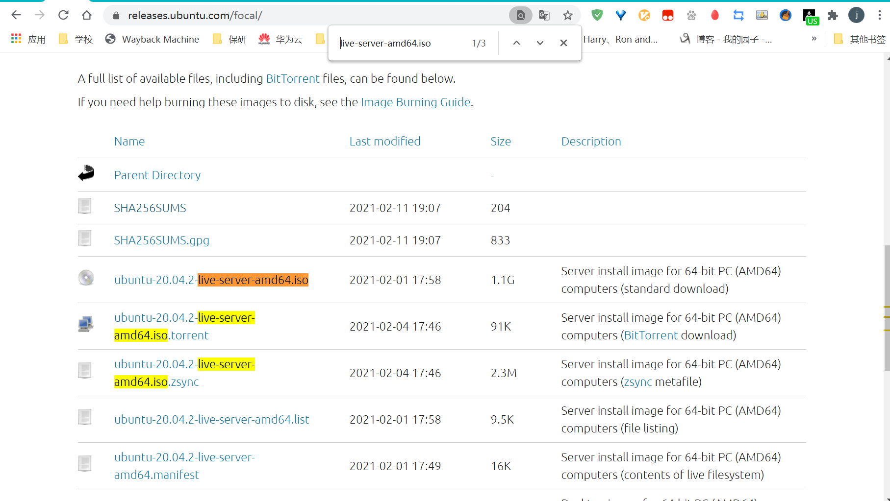
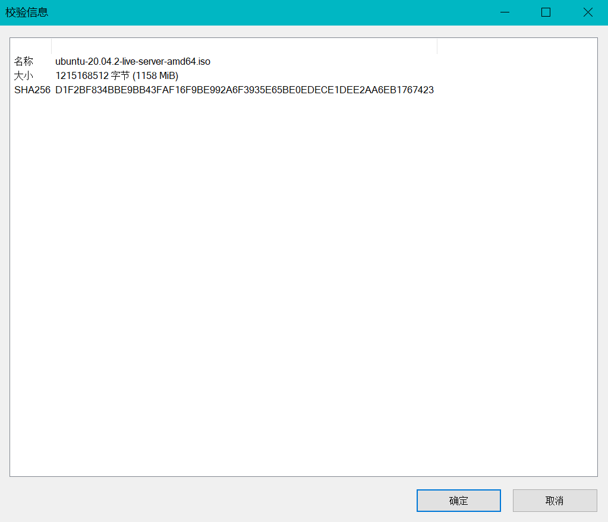
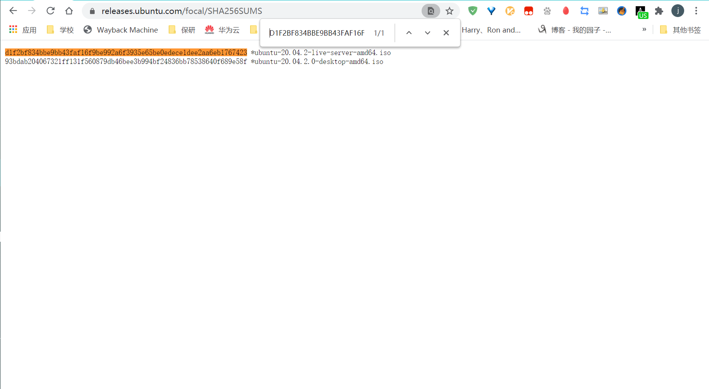
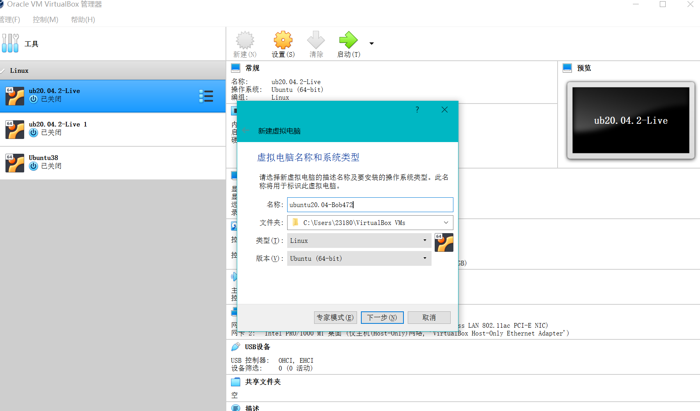
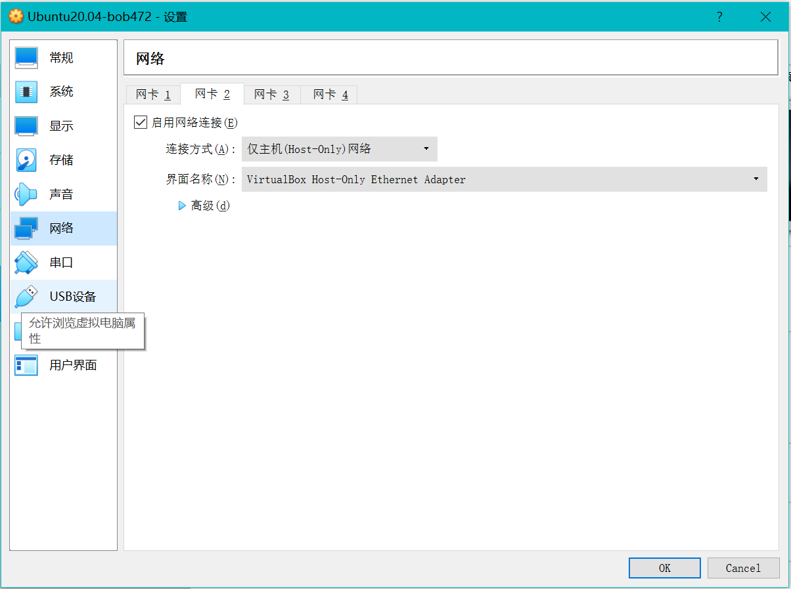
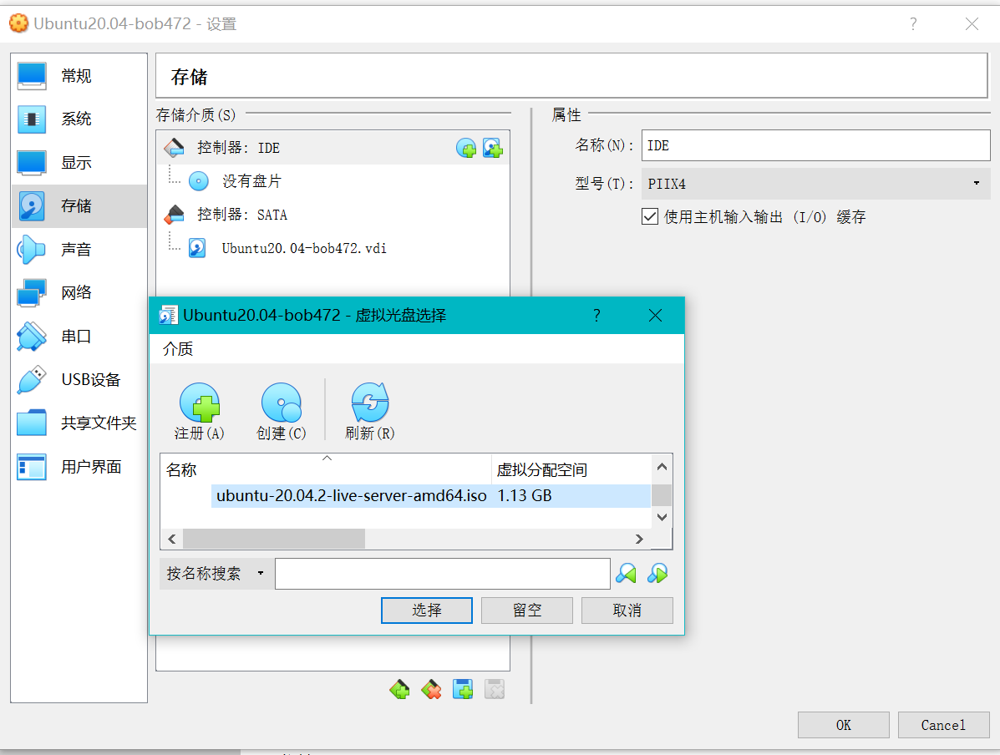
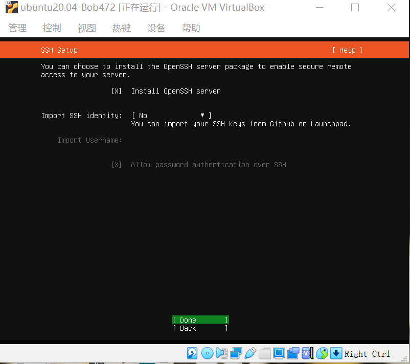
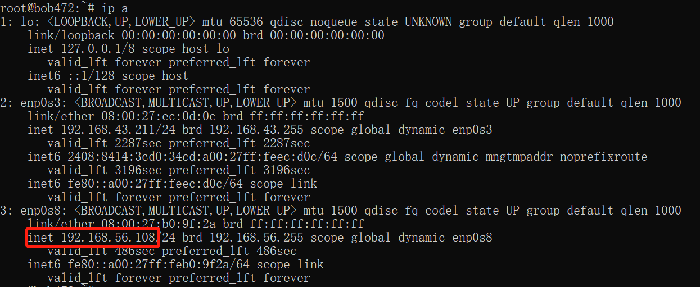
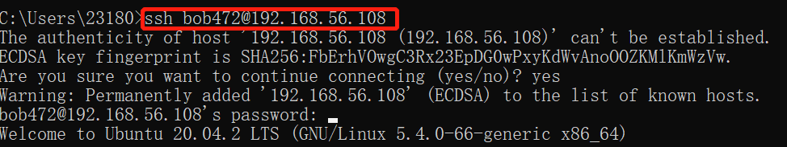
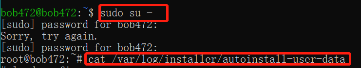

# 第一章 Linux基础-实验

## 软件环境

- Virtualbox

- Ubuntu-20.04-live-server-amd64.iso

  

## 实验问题

- 如何配置无人值守安装iso并在Virtualbox中完成自动化安装

- Virtualbox安装完Ubuntu之后新添加的网卡如何实现系统开机自动启用和自动获取IP

- 如何使用sftp在虚拟机和宿主机之间传输文件

  

  

  

## 实现Ubuntu20.04的无人值守安装

### 实现特性

- 定制一个普通用户名和默认密码

- 定制安装OpenSSH Server

  

### 具体过程

- #### 镜像下载

  - 在Ubuntu官网（https://releases.ubuntu.com/focal/）上下载Ubuntu-20.04-live-server-amd64.iso的镜像，可以利用Ctrl+F查找live-server-amd64.iso，找起来更方便。

    

  - 下载完成后使用SHA256计算文件的校验和，与官网上的哈希值相对照，用Ctrl+F进行对照更加方便和准确

    

    

  #### 

  #### 创建虚拟机

  

  - 创建虚拟机，把类型设置为linux，版本设置为Ubuntu（64-bit)

  

  - 配置虚拟机网络，将第二块网卡设置为"Host-only"格式

    

  - 选择虚拟光驱

  

  - 启动虚拟机

    

  #### 配置虚拟机

  - 定制一个普通用户名和默认密码

    

  - 定制安装Open SSH Server

  

  - 获取虚拟机的ip地址

    

  - 建立虚拟机与宿主机之间的连接

    

  #### 定制镜像

  - 获取root权限并查看autoinstall-user-data

    

  - 将autointsall拷贝到宿主机的桌面

    

  - 根据老师提供的user-data对autoinstall-user-data酌情修改

    

  

  - 新建空文件meta-data，将meta-data和修改后的auto-install-data传输至虚拟机

- 安装合成iso所需插件

- 合成iso

  

- 将iso从虚拟机传输至宿主机桌面

#### 虚拟机的无人值守安装

- 移除上述虚拟机的IDE（设置-存储-控制器IDE）

- 在「控制器：SATA」下新建 2 个虚拟光盘，按顺序先挂载纯净版 Ubuntu 安装镜像文件后挂载focal-init.iso

- 启动虚拟机，中途输入一次yes，就可以离开了