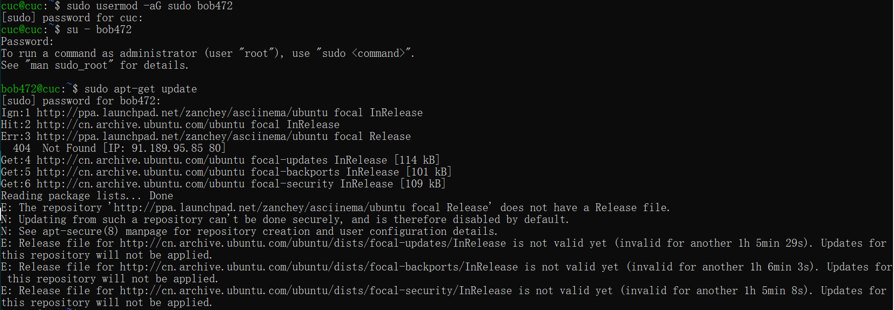
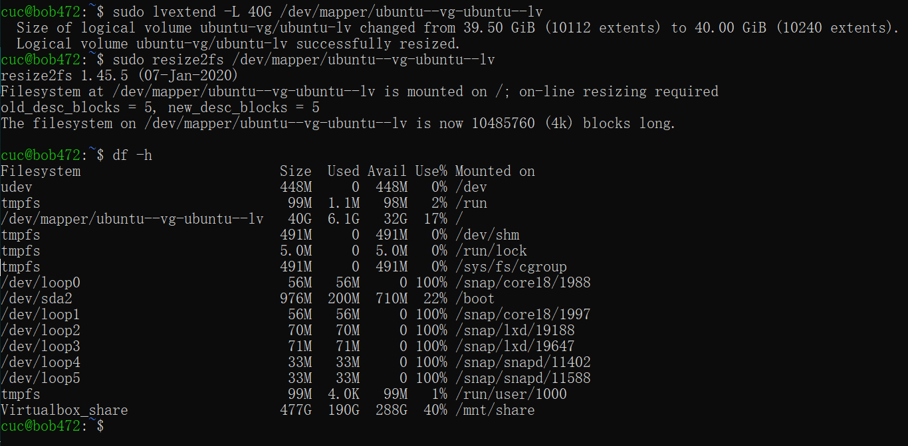

# Systemd 入门教程

# 实验内容

- 参照Systemd入门教程进行操作并录屏上传

# 实验目的

- 熟悉Systemd相关操作
- 了解文件中参数含义

# 实验环境

- Ubuntu 20.04

# 实验操作录屏

三、系统管理

[](https://asciinema.org/a/uBlyMdbrDAnfK2rxofKrc3i6X)


四、Units

[](https://asciinema.org/a/jQRmhhvP2BGkCv2u9GTTJav1k)


五、Unit的配置文件

[](https://asciinema.org/a/9zdmpHbQfjQUQ1clAHnBOeAWt)


六、target

[](https://asciinema.org/a/SP9i4jR5SU1F3eFf9tdJN2OzY)

七、日志管理

[](https://asciinema.org/a/yYdfhGKMg2jcQsg6fbkZRBnAU)


八、实战篇

[](https://asciinema.org/a/vq5YhCfIx1uyGj8LncK3oIaDP)


# 自查清单

------

- 如何添加一个用户并使其具备sudo执行程序的权限？

  ```
  sudo adduser bob472
  
  usermod -aG sudo bob472
  ```

  

  

  

- 如何将一个用户(bob472)添加到一个用户组(root)？

  `usermod -a -G root bob472`
  
  

需要加上-a参数，否则会使你离开其他用户组，仅仅做为用户组 groupA 的成员

- 如何查看当前系统的分区表和文件系统详细信息？
  
  
sudo fdisk -l
   
df -h

  


- 如何实现开机自动挂载Virtualbox的共享目录分区？
  - Windows 创建一个共享文件
  - 配置共享文件夹
  - 在虚拟机中新建共享文件夹 /mnt/dirname
  - 执行挂载命令 

```sudo mount -t vboxsf [Windows共享文件夹名称] /mnt/dirname```

在进行这一步时出席挂载错误“mount: /mnt/xxx: wrong fs type, bad option, bad superblock on xxx...”，

- 执行

```sudo apt-get install virtualbox-guest-utils```即可

修改 /etc/fstab 文件 在文末添加```[Windows共享文件夹名称] /mnt/dirname/ vboxsf defaults 0 0```即可完成开机自动挂载


- 基于LVM（逻辑分卷管理）的分区如何实现动态扩容和缩减容量？

  - 查看磁盘情况：
    df -h

  - 查看卷组信息：
    sudo vgdisplay


    

  - 增加磁盘容量（增加了40G）：
    sudo lvextend -L 40G /dev/mapper/ubuntu--vg-ubuntu--lv

  - 重新加载容量情况：
    sudo resize2fs /dev/mapper/ubuntu--vg-ubuntu--lv

  - 查看磁盘情况：
    df -h

下面是扩充容量的截图




- 如何通过systemd设置实现一个脚本在任何情况下被杀死之后会立即重新启动？实现***杀不死***？

`//修改脚本服务

[Service]

Restart = always

//重载修改过的配置文件

sudo systemctl daemon-reload`